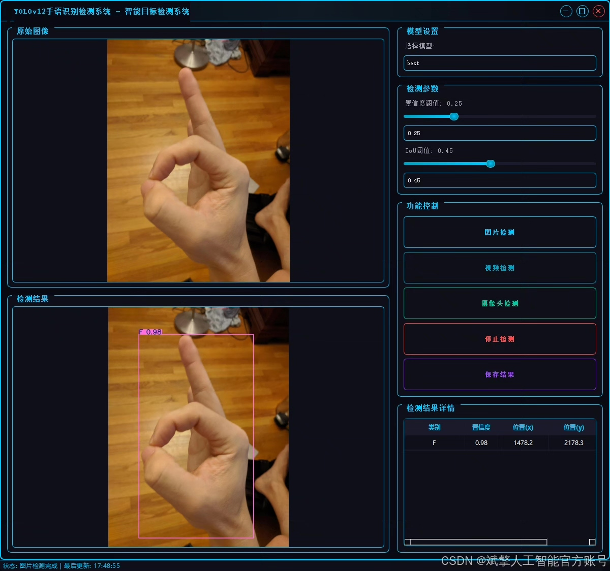
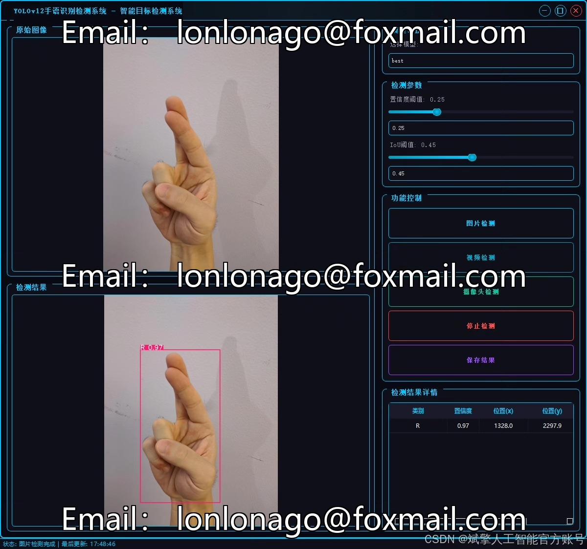
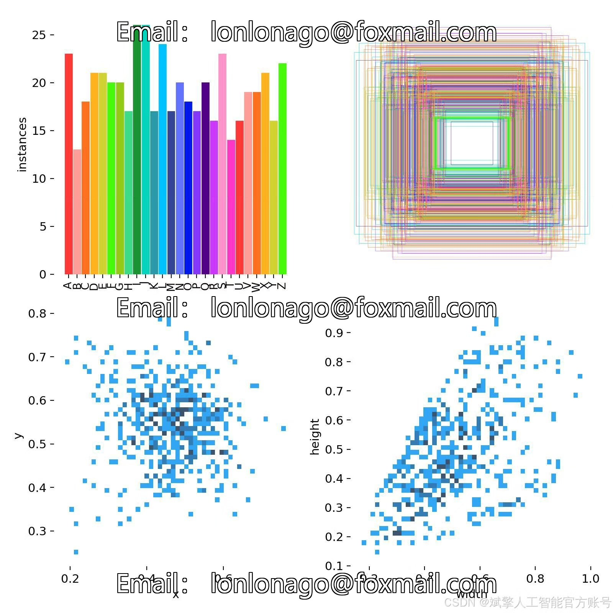
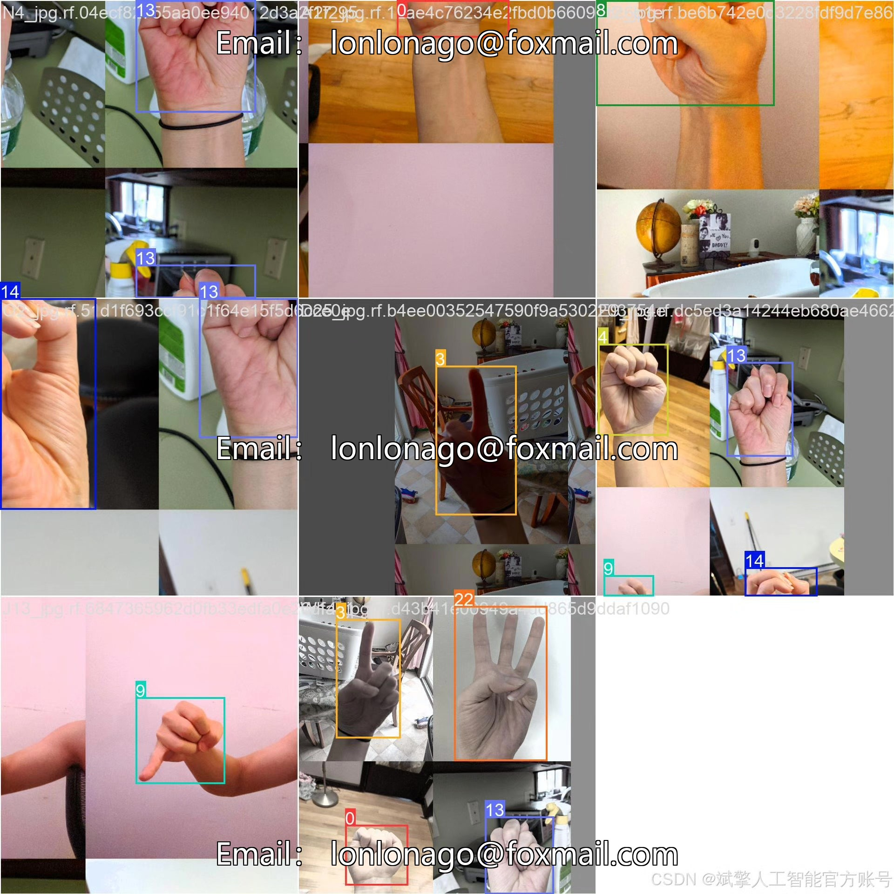
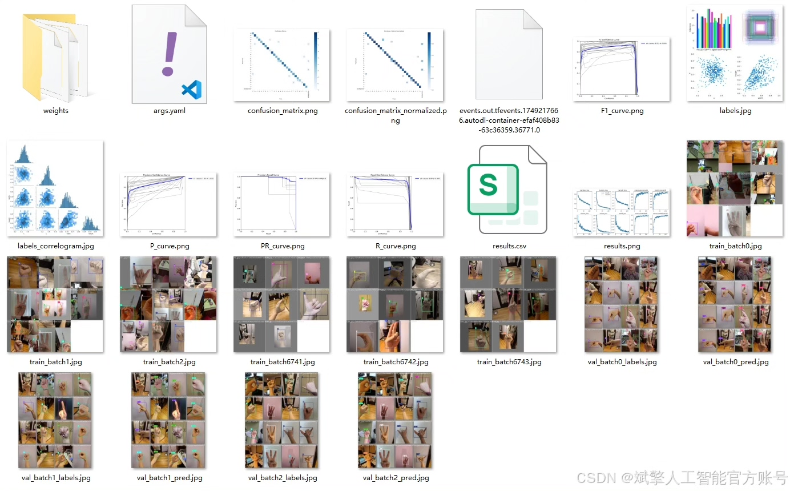
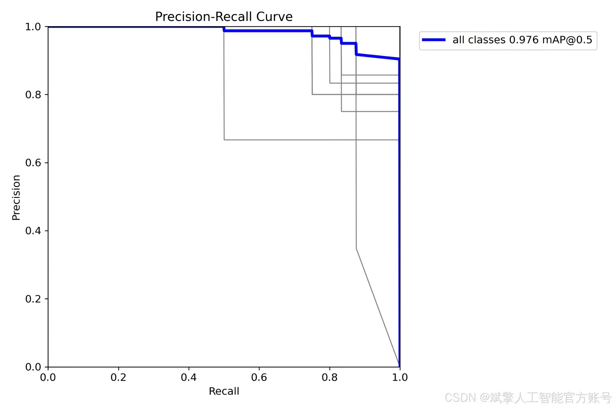
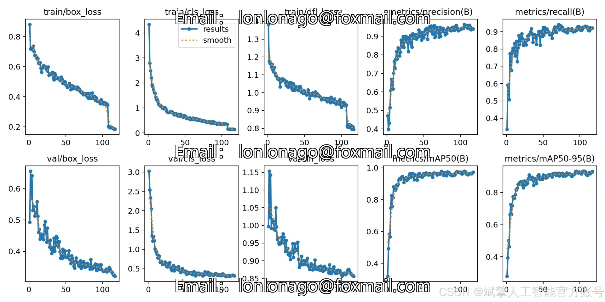
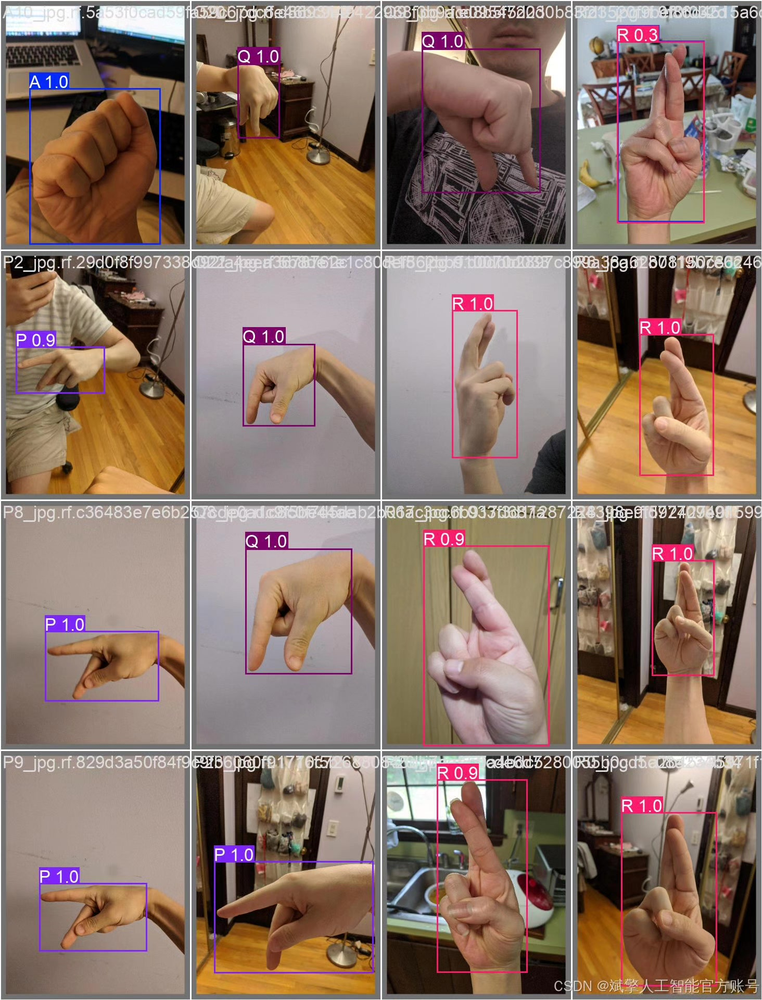
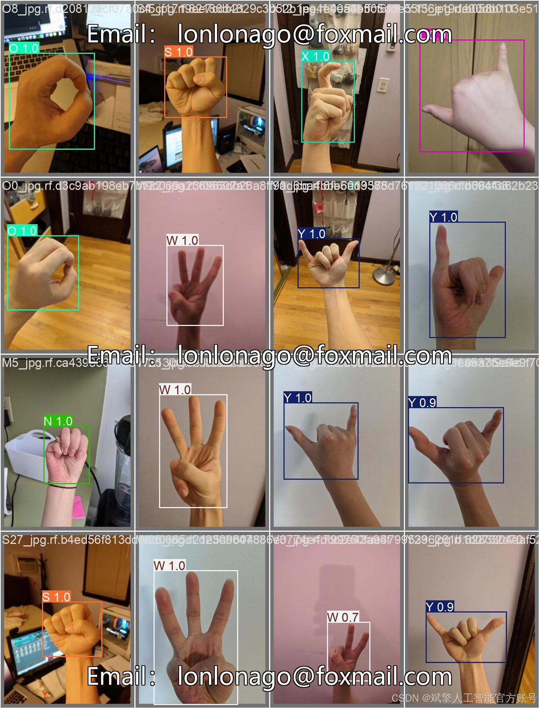

# YOLOv12 Sign Language Recognition System

## Body

YOLOv12 Hand Sign Recognition System Based on Deep Learning YOLOv12: A Real-time Sign Recognition System for Hand Signs (YOLOv12+YOLO dataset + UI interface + login and registration interface + Python project source code + model)

This paper proposes a real-time hand sign recognition system based on deep learning YOLOv12, aiming to achieve efficient and accurate detection of hand signs (A-Z). The system employs an improved YOLOv12 algorithm, combined with a custom YOLO format dataset (containing 504 training images, 144 validation images, and 72 test images), to locate and classify hand gestures through object detection technology. Additionally, the system integrates a user-friendly UI interface, supporting login and registration functions. Experimental results show that this system exhibits high detection accuracy and robustness in the task of hand sign recognition, providing a feasible solution for hand sign translation and human-computer interaction applications.

✅ User Login and Registration: Supports password verification and security validation.
✅ Three detection modes: Based on the YOLOv12 model, supports image, video, and real-time camera detection, accurately identifying targets.
✅ Dual-screen comparison: Displays the original image and detection results simultaneously on the screen.
✅ Data visualization: Real-time table displaying the category, confidence, and coordinates of detected targets.
✅ Intelligent parameter adjustment: Offers a confidence slide bar to dynamically optimize detection accuracy, adapting to different scene requirements.
✅ Sci-fi style interface: Dark theme paired with dynamic light effects, reducing visual fatigue and enhancing operational experience.

## Images

## Payment

Here is a pay link on Stripe ( https://buy.stripe.com/3cs8yP7sY87d0vu9AB ). Please contact me lonlonago@foxmail.com after funding $89, and I will send you a complete data files , thank you!

